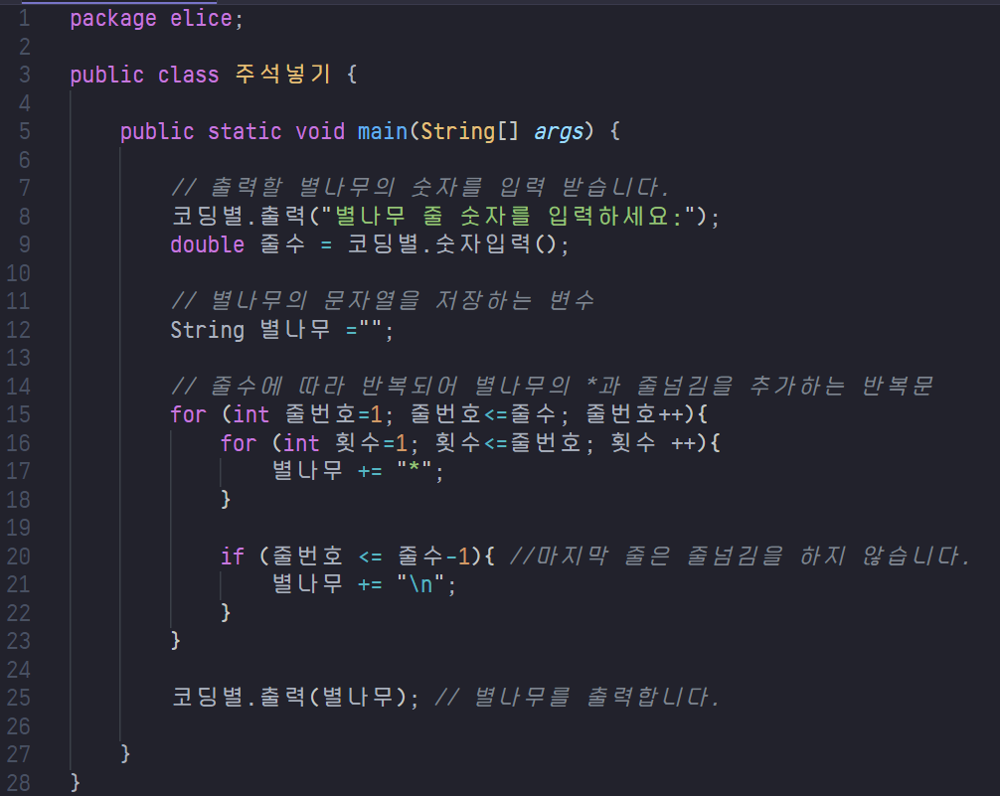

## Variable Declaration
Java의 변수 선언 방법
```Java
//[자료형] [변수명];
int i;
// 선언과 함께 초기화
double d = 3.14;
```
> 실습 예제


## Conditional Statements if else
조건문 if else
```Java
// bool 값
boolean b = true;
if(b)
{
    // b == true
}
else
{
    // b == false
}
```
> 실습 예제


## Operator ||, &&
조건이 2개일 때
```Java
boolean a = true;
boolean b = false;

// or 연산: a와 b 중 하나라도 true라면 true
boolean result = a || b;

// and 연산: 둘 다 true일때만 true
result = a && b;
```
> 실습 예제


## else if
```Java
    if(false)
    {
        // false기 때문에 다음 else if 문으로 넘어감    
    }
    else if(true)
    {
        // 로직 실행
    }
```
> 실습 예제


## for
반복문 사용법
```Java
for(int i = 0/*반복문 사용할 변수*/; i<10/*조건*/; ++i/*값 변경*/)
{
    // 반복할 내용
}
```
> 실습 예제


## for & for
이중 반복문
```Java
for(int i = 0;i<10;++i)
{
    for(int j = 0;j<10;++j)
    {

    }
}
```
> 실습 예제


## for & if
조건문과 반복문
```Java
    for(int i = 0;i<10;++i)
    {
        if(i==9)
        {
            // 조건에 맞게 실행될 명령
        }
    }
```
> 실습 예제


## comment
주석
```Java
// 주석 내용
/*
    주석 내용
*/
```
> 실습 예제


## class
클래스
```Java
class Name
{
    
}
```