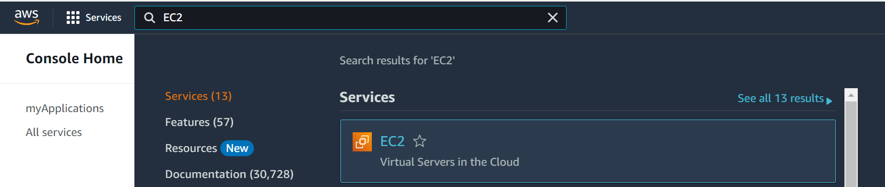
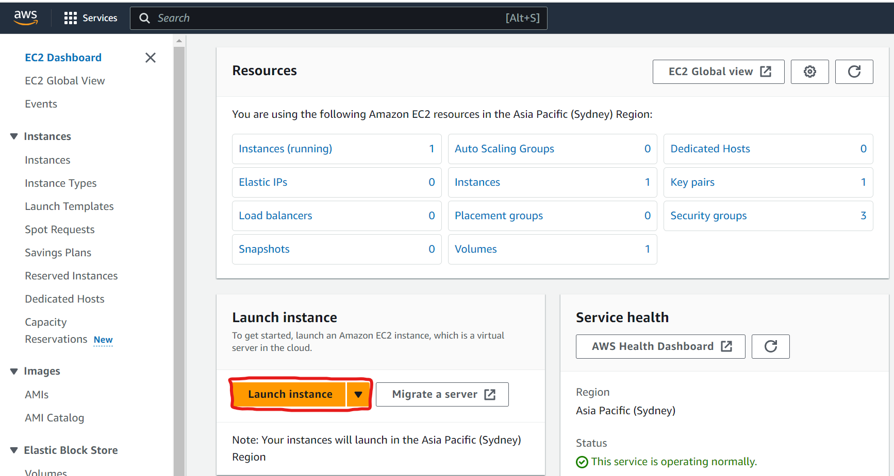
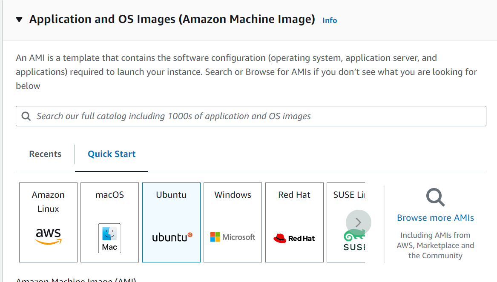
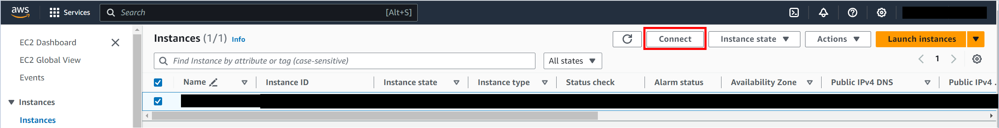
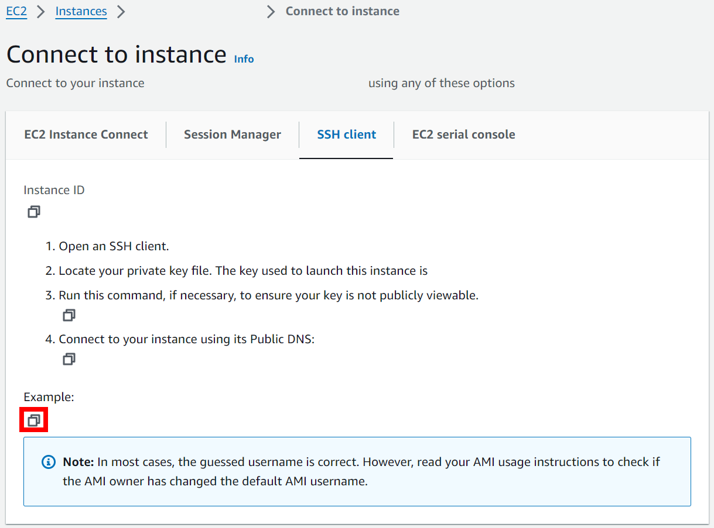
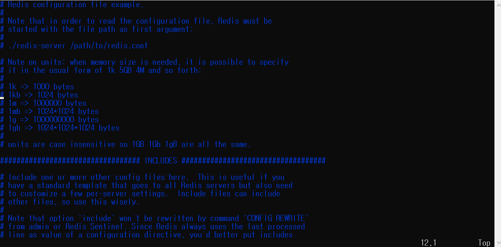
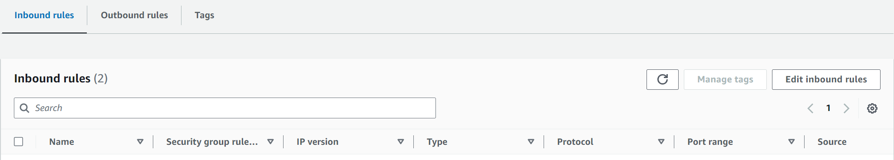
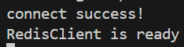

AWS EC2 인스턴스에 Redis 서버 외부접속 가능하게 설정하는 방법

## Create EC2 Instance
AWS Console Home > Search에 EC2 검색


Launch Instance 클릭


**다음 내용 설정해주기**
- Name and tags - 자유롭게 설정
- OS - 뭘로 해도 상관 없지만 이 포스트에서는 Ubuntu로 진행함. AMI는 Free tier

- Instance type - Free tier 선택하기
- Key pair - 새로 생성 또는 기존에 있는거 선택해도 됨. 기본값 사용은 비추.

## Connect Instance
Instance > Connect 클릭


Connect to Instance > SSH client > Example 복사하기


CMD 또는 PowerShell에 복사한 텍스트 입력하기  
※ Key pair가 존제하는 경로에서 입력해야됨

연결 성공 시 `Welcome to Ubuntu` 문구화 함께 추가 정보가 출력됨
## Redis Download
다음 명령어 순서대로 입력하기
1. apt-get 업그레이드 하기
```cmd
sudo apt-get update
sudo apt-get upgrade
```
2. Redis Server 설치  
```cmd
sudo apt-get install redis-server
```

## Redis Setting
외부에서 redis에 접근 가능하게 conf 파일 수정 필요함.  
`sudo vi /etc/redis/redis.conf` 입력하여 파일 열기



수정할 내용: 접속 비밀번호, 접속 가능한 ip
수정 방법: esc 누른 다음 /[찾을 내용] Enter 이후 n을 눌러 찾은 후 esc 누르고 i를 누른 뒤 수정
- 접속 비밀번호 - requirepass를 수정하면 됨
- 접속 가능한 ip - `bind에 127.0.0.1 ::1` 부분을 `0.0.0.0`으로 수정

수정 완료 후 esc > `:wq` > Enter  
자세한건 vi 편집기 검색

## Start Redis Server
`sudo systemctl start redis-server` 명령어 입력(서버 실행 명령어) 
_이후에 conf 파일 수정한다면 `sudo systemctl restart redis-server` 입력_

## Set Security Group
EC2 > Security Groups > [자신이 설정한 인스턴스에서 사용하는 보안그룹] > Edit inbound rules 클릭


자신이 접속 가능하게 수정  
※ Redis의 기본 포트 번호는 `6379`이다

## Test
모든 설정을 완료했다면 외부에서 접속하여 테스트 해보기  
_접속 시 Public IPv4 DNS를 사용하여 접속하면 됨_

