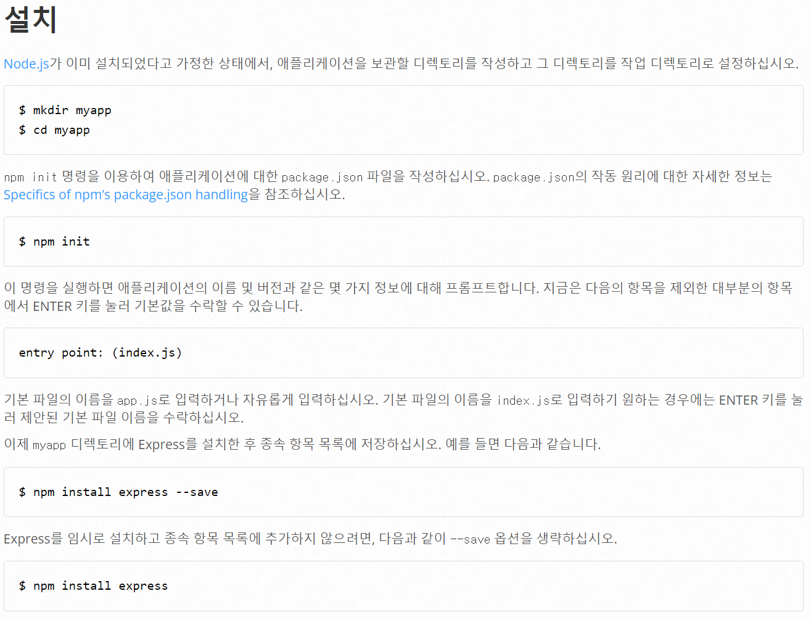

express.js를 사용하여 랭킹 정보를 저장하는 웹서버 구현

## express setting

[Express.js](https://expressjs.com/ko/starter/installing.html)에서 npm 또는 다른 package manager를 이용하여 설치

## make app.js

파일 생성하기

## design structure

랭킹 서버로 api를 호출하면 해당 api에 맞게 정보를 수정함. CRUD중 D는 필요 없을 듯
다양한 게임에 사용할 것이기 때문에 게임마다 GameID가 따로 존재함.

## set redis(DB)

데이터 베이스 세팅하기 이건 다른 게시물에서 하는게 좋을듯. AWS의 EC2를 사용함

## implement

폴더 나누기
api, lib, config도 사용

gitignore에 config 파일 추가해주기 다른 곳에 노출되면 안되는 내용 포함
git cache 초기화 해줌